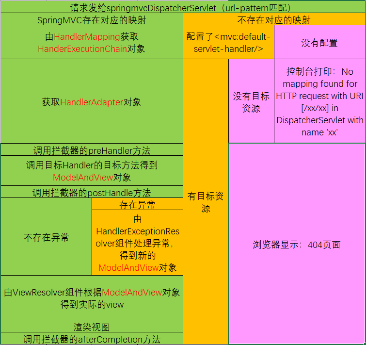

1. 概述

2. HelloWorld
   ```properties
   <bean class="org.springframework.web.servlet.view.InternalResourceViewResolver">
       <property name="prefix" value="/WEB-INF/views/"></property>
       <property name="suffix" value=".jsp"></property>
   </bean>
   ```

   1. 使用@RequestMapping 注解来映射请求的 URL
   2. 返回值会通过视图解析器解析为实际的物理视图，对于InternalResourceViewResolver 视图解析器，会做如下解析：
      1. 通过 prefix + returnVal + suffix 这样的方式得到实际的物理视图，然后做转发操作

3. RequestMapping_修饰类

4. RequestMapping_请求方式

   1. @RequestMapping 除了可以使用请求URL映射请求外，还可以使用请求方法，请求参数及请求头映射请求
   2. @RequestMapping的value、method、params及handers分别表示请求URL、请求方法、请求参数及请求头的映射条件，它们之间是与的关系，联合使用多个条件可让请求映射更加精确化。

5. RequestMapping_请求参数&请求头

   ```java
   @RequestMapping(value = "testParamsAndHeaders"
         , params = {"username", "age!=10"}
         , headers = {"Accept-Language=zh-CN,zh;q=0.8,zh-TW;q=0.7,zh-HK;q=0.5,en-US;q=0.3,en;q=0.2"})
   public String testParamsAndHeaders() {
      return SUCCESS;
   }
   ```

   1. 使用 params 和 headers 来更加精确的映射请求，params 和 headers 支持简单的表达式。

6. RequestMapping_Ant路径

   ```java
   @RequestMapping("/testAntPath/*/abc")
   public String testAntPath(){
      return SUCCESS;
   }
   ```

   1. Ant 风格资源地址支持3种匹配符：
      1. ?：匹配文件名中的一个字符
      2. *：匹配文件名中的任意字符
      3. **：匹配多层路径

7. RequestMapping_PathVariable

   ```java
   @RequestMapping("/testPathVariable/{id}")
   public String testPathVariable(@PathVariable("id") Integer id) {
      System.out.println("testPathVariable : " + id);
      return SUCCESS;
   }
   ```

   1. @PathVariable 可以来映射 URL 中的占位符到目标方法的参数中。

8. RequestMapping_HiddenHttpMethodFilter过滤器

   1. HTTP协议里面，四个表示操作方式的动词：GET、POST、PUT、DELETE，它们分别对应四种基本操作：GET用来获取资源，POST用来新建资源，PUT用来更新资源，DELETE用来删除资源。

   2. HiddenHttpMethodFilter：浏览器form表单只支持GET 与 POST 请求，而DELETE、PUT 等 method 并不支持，Spring3.0 添加了一个过滤器，可以将这些请求转换为标准的http方法，使得支持GET、POST、PUT 与 DELETE 请求。

   3. 发送PUT或DELETE请求

      1. 配置HiddenHttpMethodFilter

         ```xml
         <filter>
             <filter-name>hiddenHttpMethodFilter</filter-name>
             <filter-class>org.springframework.web.filter.HiddenHttpMethodFilter</filter-class>
         </filter>
         <filter-mapping>
             <filter-name>hiddenHttpMethodFilter</filter-name>
             <url-pattern>/*</url-pattern>
         </filter-mapping>
         ```

      2. 请求时，表单携带一个name="_method" 的隐藏域，值为DELETE 或 PUT

         ```html
         <form action="testRest/1" method="post">
             <input type="hidden" name="_method" value="PUT">
             <input type="submit" value="TestRest PUT">
         </form>
         ```

      3. Controller方法

         ```java
         @RequestMapping(value = "/testRest/{id}", method = RequestMethod.PUT)
         public String testRestPut(@PathVariable("id") Integer id) {
            System.out.println("TestRest PUT : " + id);
            return SUCCESS;
         }
         ```

9. RequestParam注解

   ```java
   @RequestMapping(value = "/testRequestParam")
   public String testRequestParam(@RequestParam(value = "username") String un
         , @RequestParam(value = "age",required = false,defaultValue = "0") int age) {
      System.out.println("testRequestParam,username : " + un + " , age : " + age);
      return SUCCESS;
   }
   ```

   1. @RequestParam 来映射请求参数
      1. value：请求参数的参数名
      2. required：该参数是否必须，默认 true
      3. defaultValue：请求参数的默认值

10. RequestHeader注解

  ```java
  @RequestMapping(value = "/testRequestHeader")
  public String testRequestHeader(@RequestHeader(value = "Accept-Language") String al) {
     System.out.println("testRequestHeader,Accept-Language : " + al);
     return SUCCESS;
  }
  ```

  1. 映射请求头信息
  2. 用法同@RequestParam
  3. 了解

11. CookieValue注解

    ```java
    @RequestMapping(value = "/testCookieValue")
    public String testCookieValue(@CookieValue(value = "JSESSIONID") String sessionId) {
       System.out.println("testCookieValue,sessionId : " + sessionId);
       return SUCCESS;
    }
    ```

12. 使用POJO作为参数

    1. SpringMVC 会按请求参数名和POJO属性名进行自动匹配，自动为该对象填充属性值，支持级联属性。

    2. 实现

       1. Java代码

          ```java
          @RequestMapping(value = "/testPojo")
          public String testPojo(User user) {
             System.out.println("testPojo,user : " + user);
             return SUCCESS;
          }
          ```

       2. html代码

          ```html
          <form action="testPojo" method="post">
              <table style="text-align:center ">
                  <tr>
                      <td>username</td>
                      <td><input type="text" name="username"></td>
                  </tr>
                  <tr>
                      <td>password</td>
                      <td><input type="password" name="password"></td>
                  </tr>
                  <tr>
                      <td>age</td>
                      <td><input type="text" name="age"></td>
                  </tr>
                  <tr>
                      <td>email</td>
                      <td><input type="text" name="email"></td>
                  </tr>
                  <tr>
                      <td>province</td>
                      <td><input type="text" name="address.province"></td>
                  </tr>
                  <tr>
                      <td>city</td>
                      <td><input type="text" name="address.city"></td>
                  </tr>
                  <tr>
                      <td colspan="2"><input type="submit" value="submit"></td>
                  </tr>
              </table>
          ```

13. 使用Servlet原生API作为参数

    ```java
    @RequestMapping(value = "/testServletAPI")
    public String testServletAPI(HttpServletRequest request, HttpServletResponse response, HttpSession session) {
       System.out.println("testServletAPI");
       System.out.println(request);
       System.out.println(response);
       System.out.println(session);
       return SUCCESS;
    }
    ```

    1. HttpServletRequest
    2. HttpServletResponse
    3. HttpSession
    4. java.security.Principal
    5. Locale
    6. InputStream
    7. OutputStream
    8. Reader
    9. Writer

14. 处理模型数据之ModelAndView

    ```java
    @RequestMapping(value = "/testModelAndView")
    public ModelAndView testModelAndView() {
       System.out.println("testModelAndView");
       ModelAndView modelAndView = new ModelAndView(SUCCESS);
       modelAndView.addObject("time",new Date());
       return modelAndView;
    }
    ```

    1. 目标方法的返回值可以是ModelAndView类型，其中可以包含视图和模型信息
    2. SpringMVC 会把 ModelAndView 的 model 中的数据放到 request 域对象中。

15. 处理模型数据之Map

    ```java
    @RequestMapping(value = "/testMap")
    public String testMap(Map<String,Object> map) {
       System.out.println("testMap");
       map.put("time",new Date());
       return SUCCESS;
    }
    ```

    1. 目标方法可以添加Map 类型（实际上也可以是Model 类型或 ModelMap 类型）的参数

16. 处理模型数据之SessionAttributes注解

    ```java
    @Controller
    @SessionAttributes(value = {"user"}, types = {Date.class})
    public class SpringMVCTest {
       public static final String SUCCESS = "success";
       
       @RequestMapping(value = "/testSessionAttributes")
       public String testSessionAttributes(Map<String, Object> map) {
          System.out.println("testSessionAttributes");
          map.put("time", new Date());
          map.put("user", new User("A", "123", 18, "a@aa.com"));
          return SUCCESS;
       }
    }
    ```

    1. 该注解只能放到类的上面，而不能修饰方法。
    2. 通过属性名指定需要放到会话中的属性（实际上使用的是 value 属性值）
    3. 通过模型属性的对象类型指定哪些模型属性需要放到会话中（实际上使用的是 types 属性）

17. ModelAttribute注解值使用场景

18. ModelAttribute注解之实例代码

    ```java
    @ModelAttribute
    public void getUser(@RequestParam("id")Integer id, Map<String,Object> map){
       System.out.println("getUser");
       User bb = null;
       if (id != null){
          bb = new User(2, "BB", "123", 20, "a@aa.com");
          map.put("user",bb);
       }
       System.out.println(bb);
    }
    
    @RequestMapping(value = "/testModelAttribute")
    public String testModelAttribute(@ModelAttribute("user") User user) {
       System.out.println("testModelAttribute");
       System.out.println(user);
       return SUCCESS;
    }
    ```

    1. @ModelAttribute注解可以使用在方法上，也可以用来修饰目标方法POJO类型的入参

19. ModelAttribute注解之运行原理

20. ModelAttribute注解之源码分析

21. 如何确定目标方法POJO类型参数

    1. 确定一个key：目标方法的POJO属性使用@ModelAttribute修饰，则key值即为@ModelAttribute 的value 属性值，未使用@ModelAttribute修饰，key值为类名首字母小写。
    2. 在implicitModel 中查找 key 对应的对象，若存在（在@ModelAttribute 标记的方法中在Map中保存过，且Map的key和1中 确定的key 一致），则作为入参传入。
    3. 若不存在key 对应的对象，则检查当前的Handler 是否使用 @SessionAttributes 注解修饰，若使用了该注解，且 @SessionAttributes 注解的 value 属性值中包含了 key，则会从 HttpSession 中来获取 key 所对应的 value，若存在则直接传入到目标方法的入参中，若不存在则将抛出异常。
    4. 若 Handler 没有标识 @SessionAttributes 注解或 @SessionAttributes 注解的 value 值中不包含 key，则会通过反射来创建 POJO 类型的参数，传入为目标方法的参数。
    5. SpringMVC 会把 key 和 POJO 类型的对象保存到 implicitModel 中，进而会保存到 request 中。

22. ModelAttribute注解修饰POJO类型的入参

23. SessionAttributes注解引发的异常

24. 视图解析流程分析

    1. 请求处理方法执行完成后，最终返回一个ModelAndView对象。对于那些返回String，View 或 ModelMap 等类型的处理方法，SpringMVC也会在内部将它们装配成一个ModelAndView对象，它包含了逻辑名和模型对象的视图
    2. 视图对象由视图解析器负责实例化。由于视图是无状态的，所以它们不会有线程安全的问题。

25. JstlView

    ```xml
    <!--配置国际化资源文件-->
    <bean id="messageSource" class=" org.springframework.context.support.ResourceBundleMessageSource">
        <property name="basename" value="i18n"></property>
        <!-- 支持UTF-8的中文 -->
        <property name="cacheSeconds" value="0"/>
        <property name="defaultEncoding" value="UTF-8"/>
    </bean>
    ```

    1. 配置国际化资源文件

26. mvc_view-controller标签

    ```xml
    <!--配置直接转发的页面-->
    <!--可以直接对应转发的页面，而无需再经过 Handler 的方法-->
    <mvc:view-controller path="/success" view-name="success"/>
    <!--在实际开发中通常都需要配置mvc:annotation-driven 标签,否则，如果配置了view-controller标签，却没配置annotation-driven标签，会导致普通的映射不起作用-->
    <mvc:annotation-driven/>
    ```

27. 自定义视图

    1. 配置一个视图解析器

       ```xml
       <!--配置视图 BeanNameViewResolver 解析器：使用视图的名字来解析视图-->
       <bean class="org.springframework.web.servlet.view.BeanNameViewResolver">
           <!--通过order属性来定义视图解析器的优先级， order值越小优先级越优先-->
           <property name="order" value="100"/>
       </bean>
       ```

    2. 创建一个视图

       ```java
       @Component
       public class HelloView implements View {
          @Override
          public String getContentType() {
             return "text/html";
          }
       
          @Override
          public void render(Map<String, ?> model, HttpServletRequest request, HttpServletResponse response) throws Exception {
             response.getWriter().println("hello view, time : " + new Date());
          }
       }
       ```

28. 重定向

    1. 一般情况下，控制器方法返回字符串类型的值会被当成逻辑视图名处理。
    2. 如果返回的字符串中带有forward: 或 redirect: 前缀时，SpringMVC 会对它们进行特殊处理：将forward: 和 redirect: 当成指示符，其后的字符串作为URL来处理（/都代表当前web应用）

29. RESTRUL_CRUD_需求

30. RESTRUL_CRUD_显示所有员工信息

31. RESTRUL_CRUD_添加操作&表单标签

    ```jsp
    %@ taglib prefix="form" uri="http://www.springframework.org/tags/form" %>
    <html>
    <head>
        <title>user</title>
    </head>
    <body>
    <form:form action="user" method="POST" modelAttribute="user">
        <table style="text-align:center ">
            <tr>
                <td>username</td>
                <td><form:input path="username"/></td>
            </tr>
            <tr>
                <td>password</td>
                <td><form:password path="password"/></td>
            </tr>
            <tr>
                <td>province</td>
                <td><form:input path="address.province"/></td>
            </tr>
            <tr>
                <td colspan="2"><input type="submit" value="submit"></td>
            </tr>
        </table>
    </form:form>
    ```

    1. SpringMVC 的表单标签：可以实现将模型数据中的属性和 HTML 表单的元素相绑定，以实现表单数据更便捷编辑和表单值的回显
    2. 一般情况下，通过GET请求获取表单页面，而通过POST请求提交表单页面，因此获取表单页面和提交表单页面的URL 是相同的。只要满足该最佳条件的契约，\<form:form\>标签就无需通过action属性指定表单提交的URL
    3. 可以通过modelAttribute属性指定绑定的模型属性，若没有指定该属性，则默认从request域对象中读取command的表单bean，如果该属性值也不存在，则会发生错误。

32. RESTRUL_CRUD_删除操作&处理静态资源

    1. 为什么会有这样的问题：
       1. 优雅的REST 风格的资源URL 不希望 .html 或 .do 等后缀
       2. 若将DispatcherServlet 请求映射配置为 /，则SpringMVC 将捕获WEB 容器的所有请求，包括静态资源请求，SpringMVC 会将它们当成一个普通请求处理，找不到对应处理器将导致错误。
    2. 解决：在SpringMVC 的配置文件中配置`<mvc:default-servlet-handler/>`
       1. 对请求进行筛选，如果发现是没有经过映射的请求，就将该请求交由WEB 应用服务器默认的Servlet，如果不是静态资源的请求，才由DispatcherServlet 继续处理
       2. 保证一般请求能成功，添加配置`<mvc:annotation-driven/>`

33. RESTRUL_CRUD_修改操作

34. 数据绑定流程分析

35. 自定义类型转换器

    1. 创建一个转换器类

       ```java
       @Component
       public class UserConverter implements Converter<String,User> {
          @Override
          public User convert(String source) {
             //username-password-age-email
             if(StringUtils.isNotBlank(source)){
                String[] split = source.split("-");
                if (split.length == 4){
                   User user = new User(split[0], split[1], Integer.parseInt(split[2]), split[3]);
                   System.out.println("UserConverter-source:"+source);
                   System.out.println("UserConverter-user:"+user);
                   return user;
                }
             }
             return null;
          }
       }
       ```

    2. 配置文件中配置自定义转换器

       ```xml
       <mvc:annotation-driven conversion-service="conversionService"/>
       
       <!--配置ConversionService-->
       <bean id="conversionService" class="org.springframework.context.support.ConversionServiceFactoryBean">
           <property name="converters">
               <set>
                   <ref bean="userConverter"/>
               </set>
           </property>
       </bean>
       ```

36. annotation-driven配置

    1. `<mvc:annotation-driven />`会自动注册RequestMappingHandlerMapping、RequestMappingHandlerAdapter与ExceptionHandlerExceptionResolver三个bean
    2. 还将提供以下支持：
       1. 支持使用ConversionService实例对表单参数进行类型转换
       2. 支持使用@NumberFormat annotation、@DateTimeFormat注解完成数据类型的格式化
       3. 支持使用@Valid注解对JavaBean实例进行JSR303验证
       4. 支持使用@RequestBody 和 @ResponseBody注解

37. InitBinder注解

    ```java
    /**
     * 不自动绑定对象中的roleSet 属性，另行处理
     * @param dataBinder
     */
    @InitBinder
    public void initBinder(WebDataBinder dataBinder){
       dataBinder.setDisallowedFields("roleSet");
    }
    ```

    1. 由@InitBinder标识的方法，可以对WebDataBinder对象进行初始化。WebDataBinder 是 DataBinder 的子类，用于完成由表单字段到JavaBean属性的绑定
    2. @InitBinder方法不能有返回值，它必须声明为void
    3. @InitBinder方法的参数通常是WebDataBinder

38. 数据的格式化

    1. 对日期和数字进行格式化

       1. 配置`<mvc:annotation-driven/>`

       2. POJO类使用注解设置数据格式

          ```java
          @DateTimeFormat(pattern = "yyyy-MM-dd")
          private Date birth;
          @NumberFormat(pattern = "#,###,###.##")
          private Float salary;
          ```

    2. 收集数据转换失败信息，使用BindingResult

       ```java
       @RequestMapping(value = "user", method = RequestMethod.POST)
       public String add(User user, BindingResult result) {
          System.out.println(user);
          if (result.getErrorCount() > 0) {
             System.out.println("出错了");
             List<FieldError> fieldErrors = result.getFieldErrors();
             for (FieldError fieldError : fieldErrors) {
                System.out.println(fieldError.getField() + " : " + fieldError.getDefaultMessage());
             }
          }
          return "user/user";
       }
       ```

    3. 使用自定义的数据转换器并使数据格式化生效，自定义的数据转换器需要配置为FormattingConversionServiceFactoryBean类的属性

       ```xml
       <mvc:annotation-driven conversion-service="conversionService"/>
       
       <!--配置ConversionService-->
       <bean id="conversionService" class="org.springframework.format.support.FormattingConversionServiceFactoryBean">
           <property name="converters">
               <set>
                   <ref bean="userConverter"/>
               </set>
           </property>
       </bean>
       ```

39. JSR303数据校验

    1. 如何校验
       1. JSR 303
          1. JSR 303 是 Java 为 Bean 数据合法性校验提供的标准框架，它已经包含在 JavaEE 6.0中。
          2. JSR 303 通过在 Bean属性上标注类似于 @NotNull、@Max 等标准的注解指定校验规则，并通过标准的验证接口对Bean进行验证
          3. Hibernate Validator 是 JSR 303 的一个参考实现，除支持所有标准的校验注解外，它还支持以下的扩展注解，如：@Email
       2. 校验
          1. 使用JSR 303 验证标准
          2. 加入 hibernate validator 验证框架的 jar 包
          3. 在 SpringMVC 配置文件中添加`<mvc:annotation-driven/>`
          4. 需要在bean 的属性上添加对应的注解
          5. 在目标方法 bean 类型的前面添加 @Valid 注解
    2. 验证出错转向到哪个页面
       1. 使用BindingResult收集错误信息
       2. 注意：需要验证的Bean 对象和其绑定结果对象或错误对象是成对出现的，它们之间不允许声明其它的入参
    3. 错误消息，如何显示，如何把错误消息进行国际化

40. 错误消息的显示及国际化

    1. 使用`<form:errors path="*"/>`显示错误
       1. 显示所有错误：path="*"
       2. 显示单独属性的错误：path="属性名"
    2. 错误消息国际化
       1. 配置国际化资源文件
       2. 键值对的键需要满足一定的规则：校验注解.Bean名.属性名，例如：NotEmpty.user.username
       3. 键值对的值就是错误消息

41. 返回JSON

    1. 添加三个jackson的jar包
    2. 编写目标方法，使其返回JSON对应的对象或集合
    3. 在目标方法添加`@ResponseBody`注解

42. HttpMessageConverter原理

43. 使用HttpMessageConverter

    1. 使用`HttpMessageConverter<T>`将请求信息转化并绑定到处理方法的入参中或将响应结果转为对应类型的响应信息，Spring提供了两种途径：
       1. 使用@RequestBody/@ResponseBody对处理方法进行标注
       2. 使用`HttpEntity<T>`/`ResponseEntity<T>`作为处理方法的入参或返回值

44. 国际化_概述

    1. 关于国际化
       1. 在页面上能够根据浏览器语言设置的情况对文本（不是内容），时间，数值进行本地化处理
       2. 可以在 bean 中 获取国际化资源文件 Locale 对应的消息
       3. 可以通过超链接切换 Locale，而不再依赖于浏览器的语言设置情况
    2. 解决
       1. 使用JSTL 的 fmt 标签
       2. 在 bean 中注入ResourceBundleMessageSource 的实例，使其对应 getMessage 方法即可
       3. 配置 LocaleResolver和 LocaleChangeInterceptor

45. 国际化_前两个问题

46. 国际化_通过超链接切换Locale

    1. 配置 SessionLocaleResolver和 LocaleChangeInterceptor

       ```java
       <!--配置SessionLocaleResolver-->
       <bean id="localeResolver" class="org.springframework.web.servlet.i18n.SessionLocaleResolver"/>
       
       <!--配置LocaleChangeInterceptor-->
       <mvc:interceptors>
           <bean class="org.springframework.web.servlet.i18n.LocaleChangeInterceptor"/>
       </mvc:interceptors>
       ```

    2. 超链接加上请求参数locale=zh_CN

       ```jsp
       <a href="<%=request.getContextPath()%>/i18n?locale=zh_CN">中文</a>
       <a href="<%=request.getContextPath()%>/i18n?locale=en_US">英文</a>
       ```

47. 文件上传

48. 第一个自定义的拦截器

    1. 自定义一个类，实现HandlerInterceptor接口

    2. springmvc配置文件配置拦截器

       ```xml
       <mvc:interceptors>
           <!--配置自定义拦截器-->
           <bean class="xin.yangshuai.springmvc.interceptors.FirstInterceptor"/>
       </mvc:interceptors>
       ```

    3. 拦截器的三个方法

       1. preHandle：该方法在目标方法之前被调用，若返回值为true，则继续调用后续的拦截器和目标方法，若返回值为false，则不会再调用后续的拦截器和目标方法，可以考虑做权限，日志，事务等
       2. postHandle：调用目标方法之后，但在渲染视图之前，可以对请求域中的属性或视图做出修改
       3. afterCompletion：渲染视图之后被调用，释放资源

49. 拦截器的配置

    ```java
    <!--配置拦截器（不）作用的路径-->
    <mvc:interceptor>
        <mvc:mapping path="/user"/>
        <bean class="xin.yangshuai.springmvc.interceptors.SecondInterceptor"/>
    </mvc:interceptor>
    ```

50. 多个拦截方法的执行顺序

    1. 都返回true

       ```properties
       First#preHandle->Second#preHandle->Second#postHandle->First#postHandle->Second#afterCompletion->First#afterCompletion
       ```

    2. Second#preHandle返回false

       ```properties
       First#preHandle->Second#preHandle->First#afterCompletion
       ```

       1. 可以理解为开启就要释放资源

51. 异常处理_ExceptionHandler注解

    ```java
    @ControllerAdvice
    public class MyExceptionHandler {
    
       public static final String ERROR = "error";
    
       @ExceptionHandler({ArithmeticException.class})
       public ModelAndView handleArithmeticException(Exception e) {
          System.out.println("handleArithmeticException");
          System.out.println("出异常了 : " + e);
          ModelAndView modelAndView = new ModelAndView(ERROR);
          modelAndView.addObject("exception", e);
          return modelAndView;
       }
    }
    ```

    1. 在@ExceptionHandler 方法的入参中可以加入 Exception 类型的参数，该参数即对应发生的异常对象。
    2. 在@ExceptionHandler 方法的入参中不能传入 Map，若希望把异常信息传到页面上，需要使用ModelAndView 作为返回值
    3. @ExceptionHandler 方法标记的异常有优先级的问题
    4. 如果当前Handler 中找不到 @ExceptionHandler 的方法来处理当前方法的异常，则将去@ControllerAdvice 标记的类中查找 @ExceptionHandler 标记的方法来处理异常

52. 异常处理_ResponseStatusExceptionResolver

    1. 使用@ResponseStatus注解在自定义的异常类上，显示一个定制消息的异常页面

       ```java
       @ResponseStatus(value = HttpStatus.FORBIDDEN, reason = "用户名和密码不匹配！")
       public class UserNameNotMatchPasswordException extends RuntimeException {
          private static final long serialVersionUID = -7645726278844952650L;
       }
       ```

    2. 使用@ResponseStatus在一个方法上，方法执行成功，将显示一个异常页面

       ```java
       @ResponseStatus(value = HttpStatus.NOT_FOUND, reason = "测试")
       @RequestMapping("testResponseStatusExceptionResolver")
       public String testResponseStatusExceptionResolver(int i) {
          System.out.println("testResponseStatusExceptionResolver");
          if(i == 13){
             throw new UserNameNotMatchPasswordException();
          }
          System.out.println("not 13");
          return SUCCESS;
       }
       ```

53. 异常处理_DefaultHandlerExceptionResolver

    1. 对Spring的一些特殊异常进行处理，例如：方法请求方式异常。

54. 异常处理_SimpleMappingExceptionResolver

    ```java
    <!--配置使用 SimpleMappingExceptionResolver 来映射异常-->
    <bean class="org.springframework.web.servlet.handler.SimpleMappingExceptionResolver">
        <property name="exceptionAttribute" value="exception"/>
        <property name="exceptionMappings">
            <props>
                <prop key="java.lang.ArrayIndexOutOfBoundsException">error</prop>
            </props>
        </property>
    </bean>
    ```

    1. 为指定异常配置异常页面
    2. exceptionAttribute 的 value 表示异常的request域中的异常信息参数名
    3. prop标签key表示异常类型，值为跳转的页面

55. 运行流程图解

    

56. 源码解析

57. Spring整合SpringMVC_提出问题

    1. 通常情况下，类似于数据源，事务，整合其它框架都是放在 Spring 的配置文件中（而不是放在 SpringMVC 的配置文件中），实际上放入 Spring 的配置文件对应的 IOC 容器中的还有 Service 和 Dao。
    2. 若Spring 的 IOC 容器 和 SpringMVC 的 IOC 容器扫描包有重合的部分，就会导致有的 bean 会被创建2次
       1. 使Spring 的 IOC 容器扫描的包和 SpringMVC 的 IOC 容器扫描的包没有重合的部分
       2. 使用exclude-filter 和 include-filter 子节点来规定只能扫描的注解

58. Spring整合SpringMVC_解决方案

    1. web.xml文件添加ContextLoaderListener并加载Spring的配置文件

       ```xml
       <!-- 配置启动 Spring IOC 容器的 Listener -->
       <context-param>
           <param-name>contextConfigLocation</param-name>
           <param-value>classpath:beans.xml</param-value>
       </context-param>
       <listener>
           <listener-class>org.springframework.web.context.ContextLoaderListener</listener-class>
       </listener>
       ```

    2. SpringMVC配置文件只扫描Controller和ControllerAdvice相关注解的bean

       ```xml
       <context:component-scan base-package="xin.yangshuai.springmvc" use-default-filters="false">
           <context:include-filter type="annotation" expression="org.springframework.stereotype.Controller"/>
           <context:include-filter type="annotation" expression="org.springframework.web.bind.annotation.ControllerAdvice"/>
       </context:component-scan>
       ```

    3. Spring配置文件扫描其它注解的bean

       ```xml
       <context:component-scan base-package="xin.yangshuai.springmvc">
           <context:exclude-filter type="annotation" expression="org.springframework.stereotype.Controller"/>
           <context:exclude-filter type="annotation" expression="org.springframework.web.bind.annotation.ControllerAdvice"/>
       </context:component-scan>
       ```

59. SpringIOC容器和SpringMVCIOC容器的关系

    1. SpringMVC 的 IOC 容器中的bean 可以来引用 Spring IOC 容器中的bean，反过来则不行
    2. Spring IOC 容器中的 bean 却不能来引用 SpringMVC IOC 容器中的bean。

60. SpringMVC对比Struts2